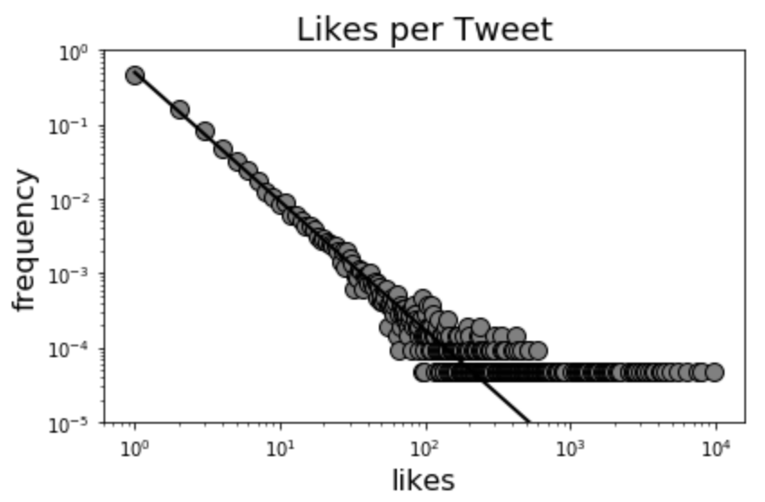
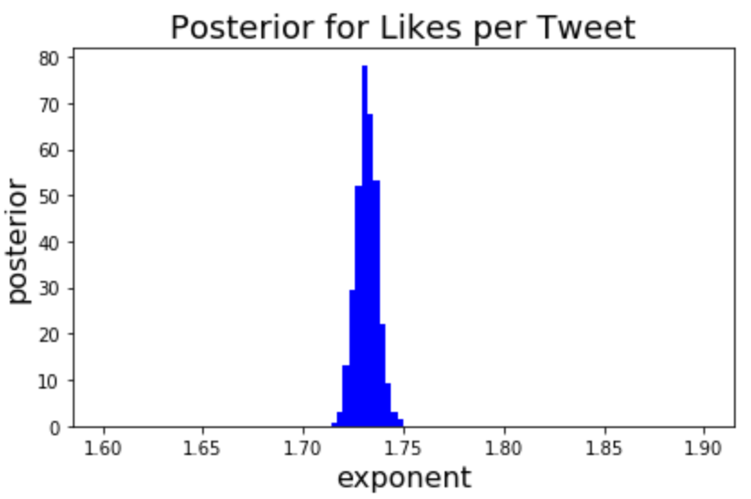

=============
BayesPowerlaw
=============

*Written by Kristina Grigaityte.*

BayesPowerlaw fits single or mixtures of power law distributions and estimate their exponent using Bayesian Inference,
specifically Markov-Chain Monte Carlo Metropolis Hastings algorithm.

Installation
------------

BayesPowerlaw can be installed from
`PyPI <https://pypi.python.org/pypi/BayesPowerlaw>`_ using the pip package manager (version 9.0.0 or higher). At the command line::

    pip install BayesPowerlaw

The code for powerlaw is open source and available on
`GitHub <https://github.com/atwal/BayesPowerlaw>`_.

Quick Start
-----------

To make the figures shown above, do this from within Python::

   import BayesPowerlaw as bp
   bp.demo()

Resources
---------

.. toctree::

   tutorial
   documentation

Contact
-------

For technical assistance or to report bugs, please 
contact `Kristina Grigaityte <kgrigait@cshl.edu>`_.

For general correspondence, please 
contact `Gurinder Atwal <atwal@cshl.edu>`_.

Indices and tables
------------------

* :ref:`genindex`
* :ref:`modindex`
* :ref:`search`