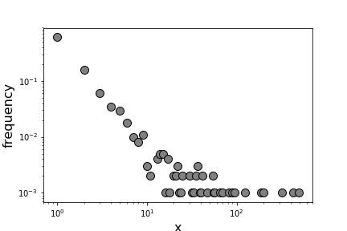
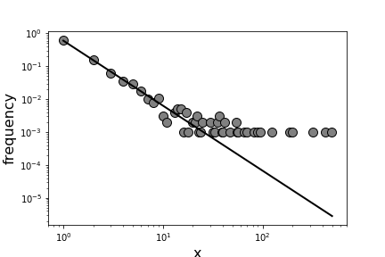
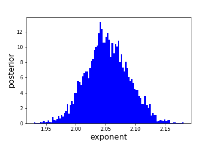
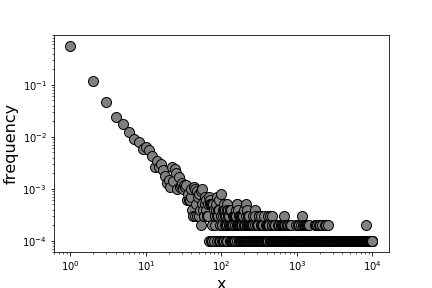
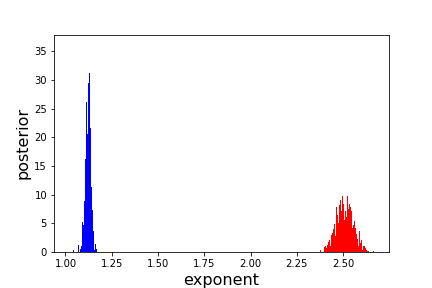
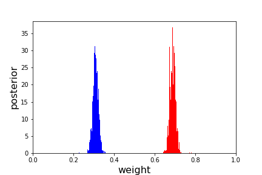

========
Tutorial
========

We begin by loading numpy, matplotlib.pyplot and BayesPowerlaw::

    import numpy as np
    import matplotlib.pyplot as plt
    import BayesPowerlaw as bp

Next we simulate a single power law distribution using the power_law function::

    #define variables for simulation
    exponents=[2.0]
    weights=[1.0]
    sample_size=1000
    xmax=10000
    #simulate data following power law distribution
    data = bp.power_law(exponents,weights,xmax,sample_size)

We can simply plot the data by running the bayes function while specifying that we don't want to perform the fitting::

    #create a bayes-data object without fitting
    bayes_object = bp.bayes(data, fit=False)
    #plot the distribution without the fit

    plt.figure(figsize=(6,4))
    bayes_object.plot_fit(1.01,scatter_size=100,data_color='gray',edge_color='black',fit=False)
    plt.xlabel('x', fontsize=16)
    plt.ylabel('frequency',fontsize=16)

Let's perform the fitting of the simulated power law and get an exponent, this will take up to 30s::

    #perform the fitting
    fit=bp.bayes(data)
    #get the posterior of exponent attribute. Since we only have a singular power law, we need only the first (index = 0) row of the 2D array.
    posterior=fit.gamma_posterior[0]
    #mean of the posterior is our estimated exponent
    est_exponent=np.mean(posterior)

Now let's plot the distribution with the fit::

    plt.figure(figsize=(6,4))
    fit.plot_fit(est_exponent,fit_color='black',scatter_size=100,data_color='gray',edge_color='black',line_width=2)
    plt.xlabel('x', fontsize=16)
    plt.ylabel('frequency',fontsize=16)

We can also plot the posterior distribution::

    plt.figure()
    fit.plot_posterior(posterior,color='blue')
    plt.xlabel('posterior', fontsize=16)
    plt.ylabel('exponent',fontsize=16)

To simulate a mixed power law distribution, input multiple exponents and their corresponding weights::

    #define variables for simulation
    exponents=[1.1,2.5]
    weights=[0.3,0.7]
    sample_size=10000
    xmax=10000
    #simulate data following power law distribution
    data = bp.power_law(exponents,weights,xmax,sample_size)

Let's plot the simulated mixed power law using bayes function::

    #create a bayes-data object without fitting
    bayes_object = bp.bayes(data, fit=False)
    #plot the distribution without the fit
    plt.figure(figsize=(6,4))
    bayes_object.plot_fit(1.01,scatter_size=100,data_color='gray',edge_color='black',fit=False)
    plt.xlabel('x', fontsize=16)
    plt.ylabel('frequency',fontsize=16)

To fit a mixture of power law, specify how many power laws are in the mixture. This will take some time::

    #perform the fitting
    fit=bp.bayes(data,mixed=2)
    #get the posterior of exponent attribute. Since we have a mixture of 2 power laws, we need 2 rows (index=0 and 1) of the 2D array.
    posterior1=fit.gamma_posterior[0]
    posterior2=fit.gamma_posterior[1]
    #also, get the weight posteriors corresponding to exponents.
    weight1=fit.weight_posterior[0]
    weight2=fit.weight_posterior[1]
    #mean of the posterior is our estimated exponent and weight.
    est_exponent1=np.mean(posterior1)
    est_exponent2=np.mean(posterior2)
    est_weight1=np.mean(weight1)
    est_weight2=np.mean(weight2)

Let's plot exponent and weight posteriors::

    plt.figure()
    fit.plot_posterior(posterior1,color='blue')
    fit.plot_posterior(posterior2,color='red')
    plt.xlabel('posterior', fontsize=16)
    plt.ylabel('exponent',fontsize=16)

    plt.figure()
    fit.plot_posterior(weight1,color='blue')
    fit.plot_posterior(weight2,color='red')
    plt.xlabel('weight', fontsize=16)
    plt.ylabel('exponent',fontsize=16)
    plt.xlim([0,1])

Note, correct answers for exponent are 1.1 and 2.5. Correct answers for weights are 0.3 and 0.7 respectively.

